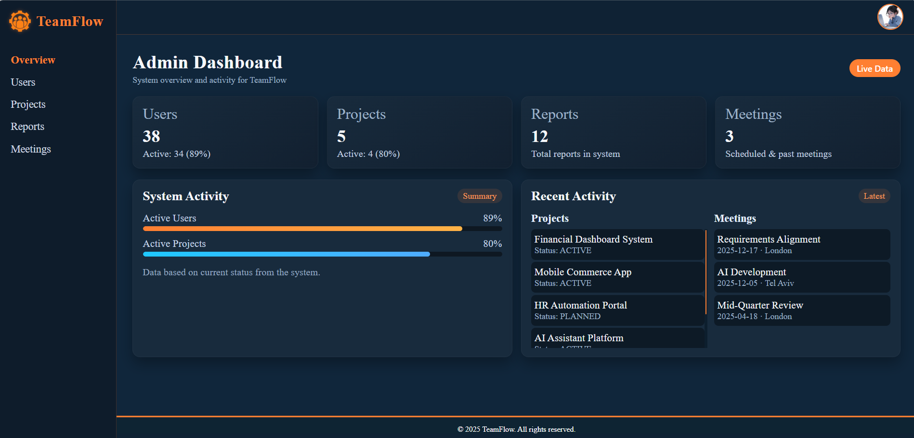
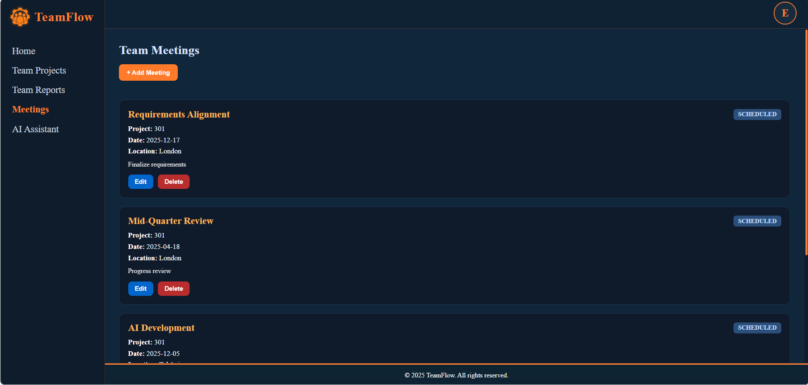
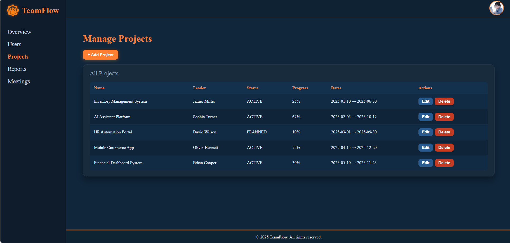
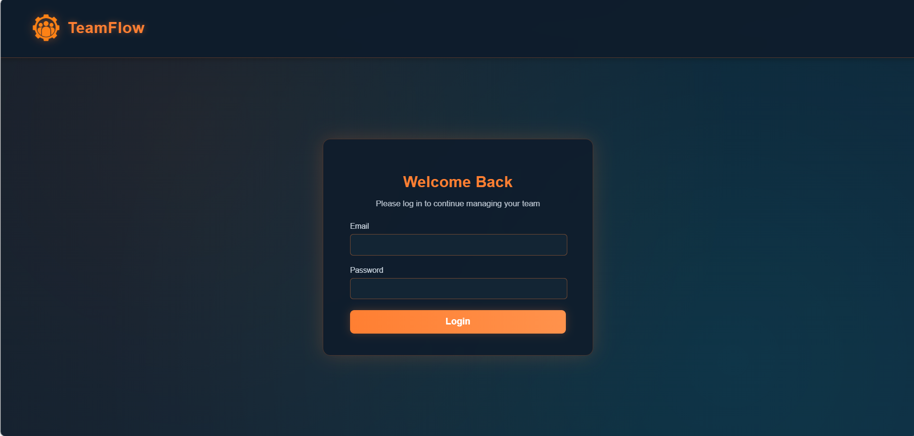

<h1 align="center">TeamFlow</h1>
<h3 align="center">Enterprise Team Management Platform</h3>

<h2>Overview</h2>

TeamFlow is a full-stack Team Management Platform designed to manage organizational
structure, user roles, and team operations using a secure and scalable architecture.

The system demonstrates strong backend engineering principles, secure authentication
implementation, structured frontend architecture, and automation-ready design.
It was developed with emphasis on clean code, separation of concerns, and production-oriented standards.

<h2>Core Capabilities</h2>

<h3>Role-Based Access Control</h3>

<ul>
  <li><strong>Admin</strong>
    <ul>
      <li>Full user lifecycle management</li>
      <li>Role assignment and permission control</li>
      <li>System-wide visibility</li>
    </ul>
  </li>

  <li><strong>Team Leader</strong>
    <ul>
      <li>Team member management</li>
      <li>Meeting creation and tracking</li>
      <li>Operational oversight</li>
    </ul>
  </li>

  <li><strong>Employee</strong>
    <ul>
      <li>Profile management</li>
      <li>Meeting participation</li>
      <li>Controlled access to team resources</li>
    </ul>
  </li>
</ul>

All permissions are enforced at backend level using Spring Security.

<h2>System Architecture</h2>

The platform follows a layered architecture:

<pre>
Controller → Service → Repository → Database
</pre>

<h3>Backend Design</h3>
<ul>
  <li>RESTful API</li>
  <li>DTO pattern for secure data transfer</li>
  <li>Service-layer business logic isolation</li>
  <li>Spring Data JPA abstraction</li>
  <li>Centralized exception handling</li>
  <li>JWT-based authentication</li>
  <li>BCrypt password encryption</li>
</ul>

<h3>Frontend Design</h3>
<ul>
  <li>Angular component-based architecture</li>
  <li>Route guards for role-based protection</li>
  <li>Modular API services</li>
  <li>Strong TypeScript typing</li>
  <li>Clear separation of concerns</li>
</ul>

<h2>Technology Stack</h2>

<h3>Backend</h3>
<ul>
  <li>Java</li>
  <li>Spring Boot</li>
  <li>Spring Security (JWT)</li>
  <li>Spring Data JPA</li>
  <li>Hibernate</li>
  <li>H2 In-Memory Database</li>
</ul>

<h3>Frontend</h3>
<ul>
  <li>Angular</li>
  <li>TypeScript</li>
  <li>HTML5</li>
  <li>CSS3</li>
</ul>

<h3>DevOps & Tooling</h3>
<ul>
  <li>Git / GitHub</li>
  <li>Postman</li>
  <li>Jenkins</li>
  <li>Automated API Testing</li>
  <li>Automated UI Testing</li>
</ul>

<h2>Database Design</h2>

The system uses H2 in-memory database for development and testing.
The architecture is designed for seamless migration to production-grade databases
such as MySQL or PostgreSQL.

Main entities:

<ul>
  <li>User</li>
  <li>Role</li>
  <li>Team</li>
  <li>Meeting</li>
  <li>Task</li>
</ul>

<h2>Security Implementation</h2>

<ul>
  <li>Stateless JWT authentication</li>
  <li>Role-based authorization</li>
  <li>BCrypt password hashing</li>
  <li>Protected REST endpoints</li>
  <li>Angular route guards</li>
</ul>

Unauthorized access is restricted at both backend and frontend layers.

<h2>Application Screenshots</h2>

  
  

  
  

  
  

  
  

  
  

  

<h2>Installation</h2>

<h3>Clone Repository</h3>

<pre>
git clone https://github.com/your-username/TeamFlow.git
cd TeamFlow
</pre>

<h3>Backend</h3>

<pre>
mvn spring-boot:run
</pre>

Default: http://localhost:8080

H2 Console: http://localhost:8080/h2-console

<h3>Frontend</h3>

<pre>
npm install
ng serve
</pre>

Default: http://localhost:4200

<h2>Engineering Highlights</h2>

<ul>
  <li>Clean layered architecture</li>
  <li>Strong separation of concerns</li>
  <li>Secure authentication flow</li>
  <li>Role-based authorization enforcement</li>
  <li>Automation-ready infrastructure</li>
  <li>CI integration compatible</li>
  <li>Production migration-ready design</li>
</ul>

<h2>Future Enhancements</h2>

<ul>
  <li>Migration to production-grade SQL database</li>
  <li>Docker containerization</li>
  <li>Cloud deployment</li>
  <li>Real-time notifications</li>
  <li>Advanced dashboard analytics</li>
</ul>

Developed by Sara 
Software Engineering Student

